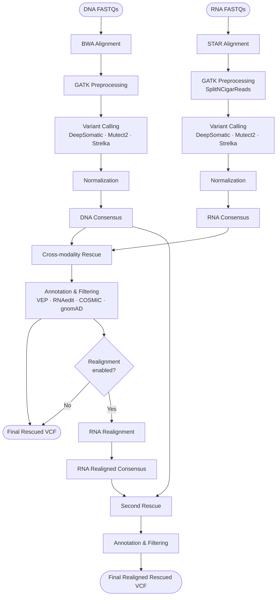

# FASTQ to Rescued VCF: Labeling, Workflow, and FILTER Interpretation

## Purpose

This document traces the rnadnavar pipeline from raw DNA/RNA FASTQ inputs to final rescued VCF outputs. It covers how samples are labeled, how the pipeline processes them step by step, and how to interpret FILTER values in the output files.

Scope:
- Input labeling and metadata propagation
- End-to-end workflow from alignment to rescue and optional second rescue
- How FILTER values are assigned in consensus and rescue outputs
- Verified against a real run: COO8801.shared (2026-03-18)

Not covered: algorithm changes or code behavior changes.

---

## 1. Pipeline Overview

The pipeline takes DNA and RNA sequencing reads from the same patient, calls variants independently in each modality, then combines evidence across modalities to produce a high-confidence variant set.

```
DNA FASTQs ──► BWA alignment ──► GATK preprocessing ──► Variant calling  ──┐
                                                                            ├──► Within-modality
RNA FASTQs ──► STAR alignment ──► GATK preprocessing ──► Variant calling ──┘    Consensus
                                                                                      │
                                                              ┌───────────────────────┘
                                                              ▼
                                                    Cross-modality Rescue
                                                    (DNA consensus + RNA consensus)
                                                              │
                                                              ▼
                                                    Annotation & Filtering
                                                              │
                                              ┌───────────────┴───────────────┐
                                              ▼                               ▼
                                    [Final rescued VCF]          Optional: RNA Realignment
                                                                              │
                                                                              ▼
                                                                   Second Rescue + Filtering
                                                                              │
                                                                              ▼
                                                                 [Final realigned rescued VCF]
```



---

## 2. Input Labeling and Sample Identity

### 2.1 Samplesheet labels

Each row in the samplesheet defines one sample with a `status` field that controls how the pipeline routes it.

Run input (COO8801.shared):

| patient  | status | sample    | lane | meaning        |
|----------|--------|-----------|------|----------------|
| COO8801  | 0      | COO8801DN | LX   | DNA normal     |
| COO8801  | 1      | COO8801DT | LX   | DNA tumor      |
| COO8801  | 2      | COO8801RT | LX   | RNA tumor      |

Routing rules:
- `status <= 1` → DNA path (BWA alignment)
- `status == 2` → RNA path (STAR alignment)

### 2.2 Metadata propagation

Channel metadata (patient, sample, lane, status, id) flows through all stages. The `id` at the FASTQ stage follows the pattern `sample-lane`, e.g. `COO8801DT-LX`.

Implementation: `subworkflows/local/samplesheet_to_channel/main.nf`

---

## 3. Run Configuration (COO8801.shared)

Key parameters used in this run:

| Parameter                        | Value                                                        |
|----------------------------------|--------------------------------------------------------------|
| rna                              | true                                                         |
| dna                              | true                                                         |
| tools                            | deepsomatic, mutect2, strelka, vep, norm, consensus, rescue, filtering, rna_filtering, realignment |
| realignment_mode                 | vcf                                                          |
| rescue_snv_thr                   | 2                                                            |
| rescue_indel_thr                 | 2                                                            |
| enable_rna_annotation            | true                                                         |
| enable_cosmic_gnomad_annotation  | true                                                         |

Source: `pipeline_info/params_2026-03-18_20-24-15.json`

---

## 4. Workflow Stages

### Stage 1 — Alignment

- DNA reads → BWA-MEM2 → sorted BAM
- RNA reads → STAR (2-pass) → sorted BAM

### Stage 2 — GATK Preprocessing

Both DNA and RNA BAMs go through:
1. Mark duplicates
2. Base quality score recalibration (BQSR)
3. For RNA only: SplitNCigarReads (handles splice junctions)

### Stage 3 — Variant Calling

Three callers run independently on each tumor/normal pair:

| Caller      | DNA | RNA |
|-------------|-----|-----|
| DeepSomatic | ✓   | ✓   |
| Mutect2     | ✓   | ✓   |
| Strelka     | ✓   | ✓   |

### Stage 4 — Normalization

Raw VCFs from each caller are normalized (left-aligned, decomposed) using bcftools/vt before consensus.

### Stage 5 — Within-Modality Consensus

Variants supported by enough callers within the same modality (DNA or RNA) are retained. See Section 6 for logic.

### Stage 6 — Cross-Modality Rescue

Variants seen in one modality can be "rescued" using evidence from the other. See Section 7 for logic.

### Stage 7 — Annotation and Filtering

Rescued VCFs are annotated with VEP, RNA editing databases, COSMIC, and gnomAD, then filtered to produce the final output.

### Stage 8 — Optional RNA Realignment + Second Rescue

If `realignment` is enabled, RNA reads near candidate variants are realigned to improve sensitivity. A second rescue round is then run on the realigned RNA consensus.

---

## 5. Output Files

All paths are relative to the run output directory (`COO8801.shared/`).

### 5.1 Within-modality consensus

```
consensus/COO8801DT_vs_COO8801DN/COO8801DT_vs_COO8801DN.consensus.vcf.gz
consensus/COO8801RT_vs_COO8801DN/COO8801RT_vs_COO8801DN.consensus.vcf.gz
```

### 5.2 First rescue

```
rescue/COO8801DT_vs_COO8801DN_rescued_COO8801RT_vs_COO8801DN/
  ├── ...rescued.vcf.gz
  └── ...rescue.filtered.stripped.vep.vcf.gz
```

### 5.3 Realignment + second rescue

```
vcf_realignment/consensus/COO8801RT_realign_vs_COO8801DN/
  └── ...consensus.vcf.gz

vcf_realignment/rescue/COO8801DT_vs_COO8801DN_rescued_COO8801RT_realign_vs_COO8801DN/
  └── ...rescued.vcf.gz
```

### 5.4 Post-rescue annotation stages

Each rescue VCF passes through annotation steps, producing intermediate files with these suffixes in order:

```
.rescued.vcf.gz
.rescue.rna_annotated.vcf.gz
.rescue.cosmic_gnomad_annotated.*.vcf.gz
.rescue.filtered.stripped.vep.vcf.gz        ← final output
```

### 5.5 Reports

```
reports/multiqc_report.html
pipeline_info/execution_trace_2026-03-18_20-23-45.txt
pipeline_info/pipeline_dag_2026-03-18_20-23-45.html
```

---

## 6. Within-Modality Consensus Logic

**Goal:** Keep only variants that multiple independent callers agree on within the same modality (DNA or RNA).

**How it works:**

```
For each variant in a modality:
  count = number of individual callers (not consensus tools) that called it
  threshold = rescue_snv_thr (for SNVs) or rescue_indel_thr (for indels)

  if count < threshold:
      → NoConsensus

  if count >= threshold:
      tally the biological class each caller assigned
      if one class has a clear majority → assign that class
      if top classes are tied            → Artifact
```

The `PASSES_CONSENSUS` INFO field records whether the threshold was met, but the final `FILTER` value is always set by the unified classification function.

Implementation: `UnifiedVariantClassifier.classify_consensus_variant` in `bin/vcf_utils/variant_classifier_unified.py`

---

## 7. Cross-Modality Rescue Logic

**Goal:** Recover variants missed by one modality using evidence from the other. A variant seen only in RNA can be confirmed by DNA evidence, and vice versa.

**How it works:**

```
Given a variant with DNA_consensus label and/or RNA_consensus label:

Case 1 — Both modalities have a consensus label:
  ├── Same label on both sides          → use that label
  ├── Both are Artifact                 → Artifact
  ├── Both non-Artifact but disagree:
  │     ├── Both have enough caller support  → Artifact (unresolvable conflict)
  │     ├── Only one side has enough support → use that side's label
  │     └── Neither has enough support       → NoConsensus
  └── One is Artifact, one is not:
        ├── Non-Artifact side meets support requirement → use non-Artifact label
        └── Otherwise                                   → Artifact

Case 2 — Only one modality has a consensus label:
  → use that label directly

Case 3 — No consensus labels at all:
  ├── Cross-modality caller support exists → classify from that support
  └── Otherwise                            → NoConsensus
```

Implementation: `UnifiedVariantClassifier.classify_rescue_variant` in `bin/vcf_utils/variant_classifier_unified.py`

Workflow wiring: `subworkflows/local/vcf_consensus_workflow/main.nf` and `subworkflows/local/second_rescue/main.nf`

---

## 8. FILTER Values in Output VCF

### 8.1 What FILTER means

In consensus and rescue output files, the `FILTER` column contains a unified biological classification — not the raw filter string from any individual caller.

| FILTER value  | Meaning                                                        |
|---------------|----------------------------------------------------------------|
| Somatic       | Tumor-specific variant, not in normal                          |
| Germline      | Variant present in both tumor and normal (inherited)           |
| Reference     | Called as reference allele or likely sequencing artifact       |
| Artifact      | Technical artifact or unresolvable caller disagreement         |
| NoConsensus   | Insufficient caller support to make a call                     |
| RNAedit       | Known RNA editing site (assigned during annotation stage)      |

### 8.2 Original caller filters are preserved in INFO

The raw per-caller information is not lost — it is stored in INFO fields for traceability:

| INFO field          | Content                                      |
|---------------------|----------------------------------------------|
| FILTERS_ORIGINAL    | Raw FILTER strings from each caller          |
| FILTERS_NORMALIZED  | Normalized filter strings                    |
| FILTERS_CATEGORY    | Per-caller biological category               |
| UNIFIED_FILTER      | Final unified classification                 |
| UNIFIED_FILTER_DNA  | Unified classification from DNA callers only |
| UNIFIED_FILTER_RNA  | Unified classification from RNA callers only |
| PASSES_CONSENSUS    | Whether consensus threshold was met          |

**Rule of thumb:** use `FILTER` for the final call; use `INFO` fields to understand why.

Implementation: `bin/vcf_utils/classification.py`, `bin/vcf_utils/variant_classifier_unified.py`, `bin/vcf_utils/io_utils.py`

---

## 9. How Each Caller's Filters Map to Biological Classes

### 9.1 DeepSomatic

| Caller FILTER   | Biological class |
|-----------------|------------------|
| PASS / (none)   | Somatic          |
| GERMLINE        | Germline         |
| RefCall         | Reference        |
| anything else   | Artifact         |

### 9.2 Mutect2

| Caller FILTER                              | Biological class |
|--------------------------------------------|------------------|
| PASS / (none)                              | Somatic          |
| germline, haplotype                        | Germline         |
| panel_of_normals, contamination, possible_numt | Reference    |
| anything else                              | Artifact         |

### 9.3 Strelka

| Condition                                        | Biological class |
|--------------------------------------------------|------------------|
| PASS / (none)                                    | Somatic          |
| NT = het or hom, sufficient normal depth         | Germline         |
| NT = ref, sufficient normal depth                | Reference        |
| otherwise                                        | Artifact         |

---

## 10. File Naming Conventions

| Output type              | Pattern                                                    |
|--------------------------|------------------------------------------------------------|
| Within-modality consensus | `{tumor}_vs_{normal}.consensus.vcf.gz`                   |
| First rescue             | `{dna_pair}_rescued_{rna_pair}.rescued.vcf.gz`             |
| Realignment rescue       | `{dna_pair}_rescued_{rna_realign_pair}.rescued.vcf.gz`     |
| Final filtered output    | `...rescue.filtered.stripped.vep.vcf.gz`                   |

---

## 11. Verification Checklist

When updating this document, confirm:

1. All listed output files exist in a real run directory.
2. All FILTER rules match the current classifier and writer code.
3. Wording clearly distinguishes unified output `FILTER` from per-caller provenance in `INFO`.
4. Rescue section covers both first rescue and optional realignment second rescue.
5. Sample labeling examples reflect status-based routing.

---

## 12. Audience Notes

For developers: use this document alongside the classifier source files for implementation details.

For presentation audiences: the slide deck at `docs/presentation` gives a simplified flow. Slides intentionally reduce FILTER categories to Somatic, Germline, and Reference; the full taxonomy is here.

---

Verification baseline: COO8801.shared run, pipeline_info entries dated 2026-03-18.
